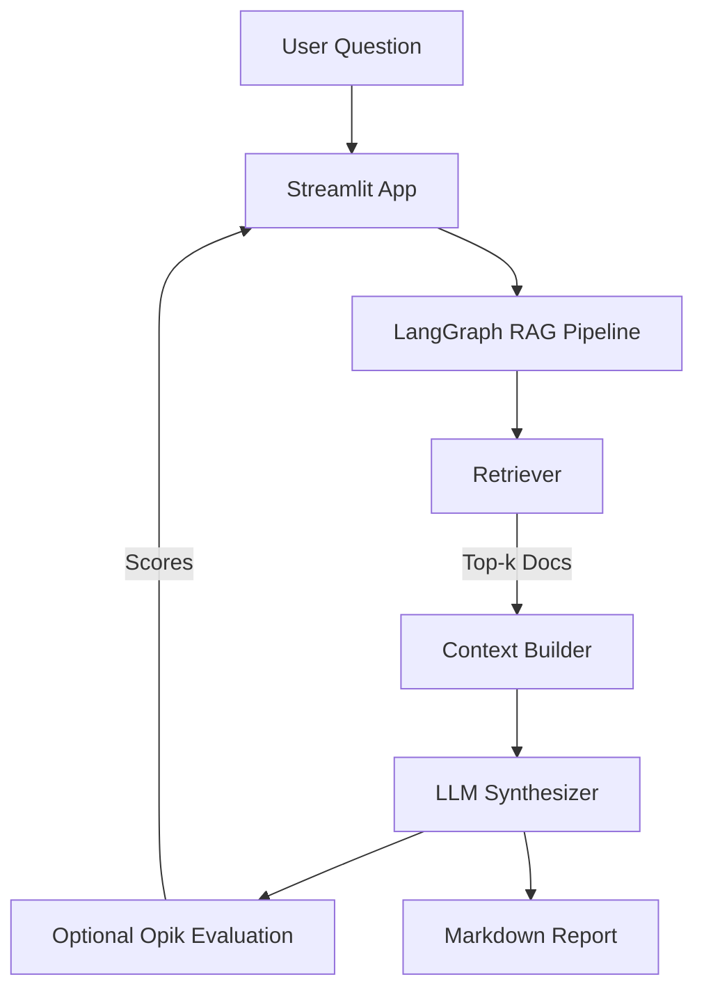

# 🛡️ AegisRAG Intelligence Agent

**AegisRAG** is an evidence-first, guardrailed Retrieval-Augmented Generation (RAG) system designed for research, enterprise, and compliance-heavy use cases.  
It combines **LangGraph**, **LangChain**, **Chroma**, and optional **Opik (Comet)** evaluation to deliver grounded answers with traceable sources.

---

## ✨ Key Capabilities

- 🔎 **Multi-source ingestion**: arXiv + Europe PMC (PubMed Central)
- 🧠 **Evidence-first RAG**: answers strictly grounded in retrieved documents
- 📚 **Citations & sources**: automatic source normalization
- 🛡️ **Hallucination-aware**: optional Opik evaluation (hallucination, relevance, context precision/recall)
- 🧩 **Composable graph**: LangGraph-based retrieval → synthesis → evaluation
- 🎨 **Streamlit UI**: clean, colorful interface for demos and internal tools
- 🏢 **Enterprise-ready**: works offline from local Chroma vector store

---

## 🏗️ Architecture Overview



---

## 📁 Project Structure

```
AegisRAG Intelligence Agent/
├── app.py                     # Streamlit UI
├── requirements.txt
├── .env                       # API keys (not committed)
├── output/
│   └── report_*.md
└── src/
    ├── main_ingest.py          # Ingest arXiv + Europe PMC
    ├── main_query.py           # CLI query runner
    ├── common.py               # Shared constants
    ├── collectors/
    │   ├── arxiv.py
    │   └── europe_pmc.py
    ├── ingest/
    │   └── index.py            # Chunk + embed into Chroma
    ├── rag/
    │   └── retriever.py        # Vector retrieval (returns Documents)
    ├── graph/
    │   └── rag_graph.py        # LangGraph RAG pipeline
    └── evaluation/
        └── opik_eval.py        # Optional Opik evaluation
```

---

## 🚀 Quickstart

### 1️⃣ Create virtual environment

```bash
python3.12 -m venv .venv
source .venv/bin/activate
```

### 2️⃣ Install dependencies

```bash
pip install -r requirements.txt
```

### 3️⃣ Configure `.env`

```env
OPENAI_API_KEY=sk-...
OPENAI_MODEL=gpt-5.2

# Optional: Opik (Comet)
OPIK_API_KEY=your_opik_key
OPIK_WORKSPACE=your_workspace
```

---

## 📥 Ingest Data

```bash
python -m src.main_ingest
```

---

## ❓ Query via CLI

```bash
python -m src.main_query
```

---

## 🖥️ Run Streamlit App

```bash
streamlit run app.py
```

---

## 🛡️ Opik (Comet) Evaluation

When enabled, AegisRAG can score outputs for hallucination, relevance, and context quality.  
Evaluation is optional and non-blocking.

---

## 📄 Output Format

Answers are returned as Markdown with sections:
- Answer
- Evidence
- What’s missing / Unknowns
- Sources

---

## 📜 License

MIT
